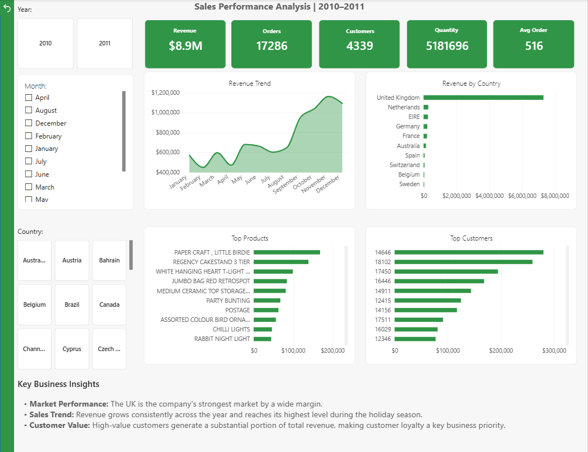
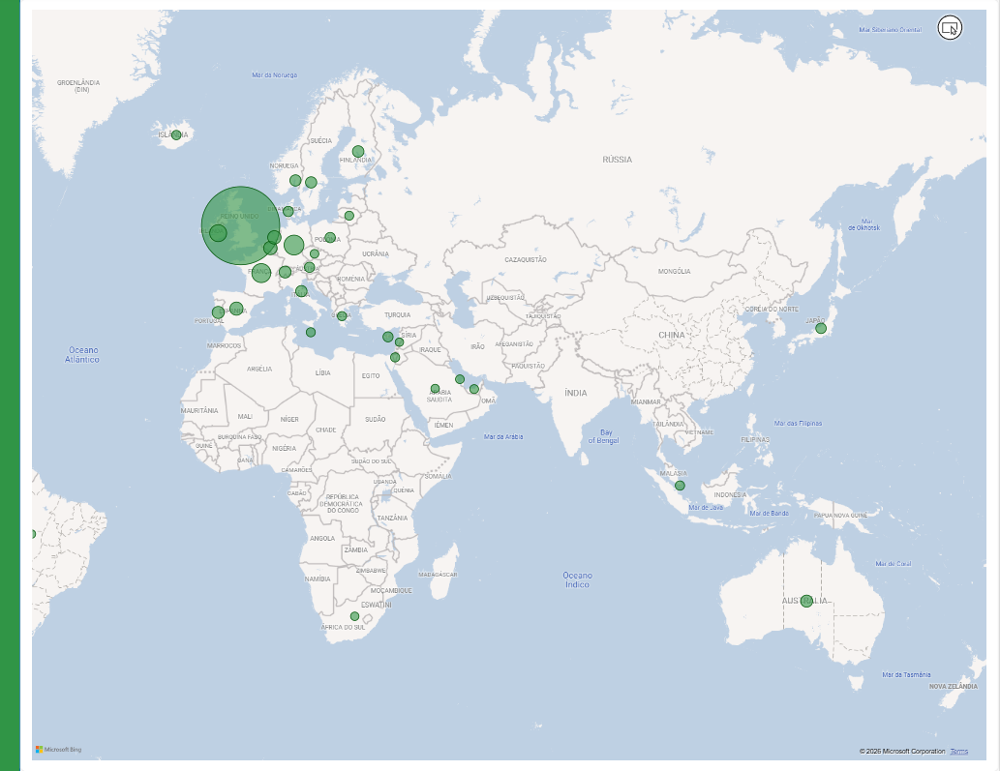

# E-Commerce Sales Executive Dashboard - Power BI

## Project Overview

This project analyzes e-commerce sales performance using Power BI. The dashboard provides insights into revenue, orders, customers, product performance, customer value, and geographic sales distribution.

## Tools Used

- Power BI Desktop
- Power Query
- DAX
- Data Modeling
- GitHub

## Dataset

The dataset contains e-commerce transaction data including invoices, products, quantities, prices, customers, countries, and transaction dates.

## Business Questions

- What is the total revenue?
- How many orders and customers does the business have?
- Which countries generate the highest revenue?
- Which products generate the most sales?
- Who are the most valuable customers?
- How does revenue evolve over time?

## Dashboard Preview

## Map Preview

## Key Metrics

- Total Revenue
- Total Orders
- Total Customers
- Total Quantity Sold
- Average Order Value

## Key Insights

- The United Kingdom is the company's largest market, generating the majority of total revenue.
- Revenue grows strongly throughout the year, with the highest performance during the final quarter.
- A relatively small group of customers contributes a significant share of total sales.
- Top-selling products represent an important part of the company's revenue concentration.
- UK generated $7.3M in revenue.
- Total revenue reached $8.91M.
- Total orders: 17.29K.

## Data Cleaning
- removed cancellations
- removed negative quantities
- removed missing CustomerID
- created revenue measure

## Skills Demonstrated

- Data cleaning with Power Query
- DAX measures
- KPI development
- Dashboard design
- Geographic analysis
- Customer analysis
- Product performance analysis
- Business insight generation
